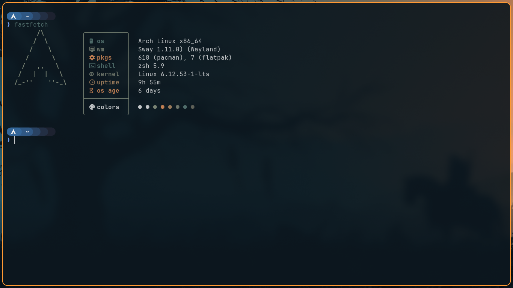
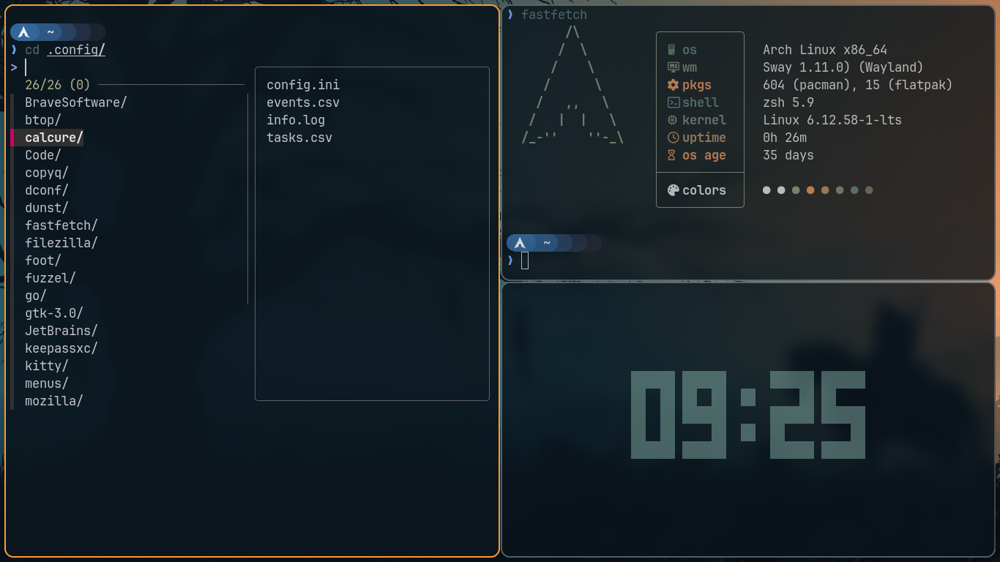
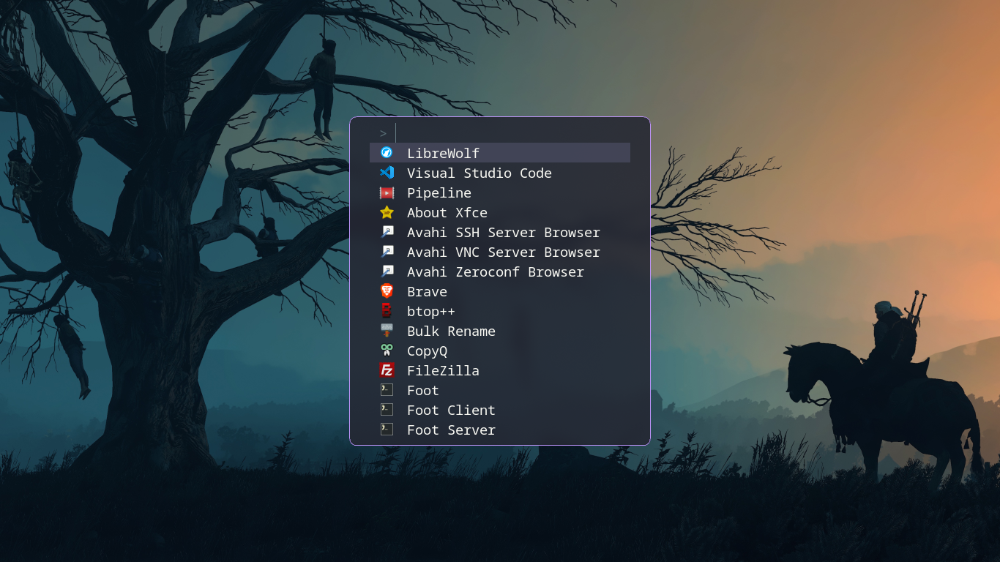

# Swayfx-Setup
My personal configuration files using [Swayfx](https://github.com/WillPower3309/swayfx) window manager
This bulit was setup on Arch-Minimal 

## Features

- Sway keybindings but without any bars
- Fuzzel launcher
- [Pywal16](https://github.com/eylles/pywal16) Integration with sway/foot 
- Handy scripts 
- Fastfetch
- Dnust
- .zshrc with starship

## Screenshots

